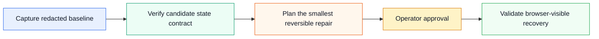

# DSH Ops Skill

[中文指南](docs/README.zh-CN.md) · [Architecture](docs/architecture.md) · [Demonstration](docs/demo.md) · [Compatibility](docs/compatibility.md) · [Roadmap](ROADMAP.md) · [Changelog](CHANGELOG.md) · [Security](SECURITY.md)

> **The upgrade-safety and runtime-reliability kit for DeepSeek Harness.**
>
> Prove the state contract, diagnose blank-instance failures without exposing sensitive data, and plan the smallest reversible recovery before a DSH upgrade becomes an incident.

`dsh-ops-skill` is an English-first, portable operational Skill for [DeepSeek Harness (DSH)](https://github.com/deepseek-ai/deepseek-harness) and other folder-based agent systems. It turns a dangerous class of runtime failures—empty session sidebars, missing model routes, `spawn bash ENOENT`, unavailable sandbox backends, and container upgrade drift—into a disciplined **evidence → plan → validation** workflow.

It is intentionally **not** a privileged Docker wrapper, an automatic state copier, or an official DeepSeek plugin. The repository provides an AI-readable `SKILL.md`, a dependency-light metadata-only doctor, recovery playbooks, a least-privilege Compose overlay, and public-safe documentation for Claude Code, Codex, OpenCode, DSH, or any system that can load a folder-based skill.

## The operating principle



A DSH service can return HTTP 200 while behaving like a fresh installation. That does not prove that state was lost: the new runtime may simply be resolving a different root because `HOME`, `DSH_HOME`, a mount destination, the entrypoint, or the workdir changed. This project treats those values as a **state contract** that must be proven before the runtime is replaced or repaired.

| It helps you establish | It deliberately never does |
|---|---|
| Whether the selected state root contains expected artifacts. | Read chats, prompts, session bodies, credentials, or settings values. |
| Whether Bash and Bubblewrap are present in the actual runtime. | Enable privileged mode, Docker Socket access, or `SYS_ADMIN` by default. |
| Whether a candidate launch contract differs from the baseline. | Copy session files into a guessed destination or overwrite state automatically. |
| Whether a recovery should proceed, stop, or roll back. | Present an incident workaround as a generic security recommendation. |

## 60-second quick start

```sh
git clone https://github.com/dragon43pp/dsh-ops-skill.git
cd dsh-ops-skill
sh scripts/dsh-doctor.sh verify
```

To emit a compact, non-secret state contract for a private before/after comparison:

```sh
sh scripts/dsh-doctor.sh contract
sh scripts/dsh-doctor.sh contract --format json
```

The contract never emits the selected state-root path. It records only artifact presence, bounded file counts, executable availability, a root-selection origin, and a one-way root fingerprint. Create two operator-controlled snapshots and compare tracked invariants without revealing their values:

```sh
sh scripts/dsh-doctor.sh snapshot /secure/path/before.contract
# Start and inspect the isolated candidate. Do not modify production yet.
sh scripts/dsh-doctor.sh snapshot /secure/path/candidate.contract
sh scripts/dsh-doctor.sh diff /secure/path/before.contract /secure/path/candidate.contract
```

A `diff` result of `UNCHANGED` exits with `0`; `REVIEW` exits with `2`, so an operator can require explicit review before promoting a candidate. The snapshot command refuses to overwrite an existing file.

To run the optional **no-write** Bubblewrap smoke test, explicitly opt in:

```sh
DSH_DOCTOR_RUN_SANDBOX=1 sh scripts/dsh-doctor.sh verify
```

The doctor reports filesystem presence and executable availability only. It does **not** read session contents, settings values, credential values, model base URLs, Docker inspection output, or storage databases.

## Engineering guarantees

| Guarantee | Implementation | What it prevents |
|---|---|---|
| Stable contract | Versioned key/value and JSON contracts with documented fields. | Fragile scraping of human-oriented terminal output. |
| Safe comparison | Explicit snapshots, non-overwrite protection, redacted diff keys, and distinct review exit code. | Accidental state copies and false confidence from HTTP health alone. |
| Reproducible tests | `sh tests/test-dsh-doctor.sh` builds a synthetic state tree and command stubs. | Regressions that only become visible in a user incident. |
| Zero privileged default | The tool has no Docker API, mutation command, network call, or automatic recovery path. | Turning a diagnosis helper into a host-privileged attack surface. |

Run the regression suite locally with:

```sh
sh tests/test-dsh-doctor.sh
```

The public quality workflow runs the same isolated tests on pull requests and `main` pushes.

## What it diagnoses

| Observable symptom | First evidence to collect | Safe next step |
|---|---|---|
| Empty sessions, fresh Settings, missing models | State root plus `settings.yaml`, `profiles/`, `sessions/`, and `storages/` presence. | Compare baseline and candidate `HOME`/`DSH_HOME` semantics before writing anything. |
| `spawn bash ENOENT` | Bash presence in the actual runtime image. | Build a derived candidate image; preserve launch contract and test it in isolation. |
| `SANDBOX_UNAVAILABLE` | Bubblewrap availability and, when requested, no-write smoke-test output. | Inspect backend compatibility; make capability changes only as an explicit threat-model decision. |
| Model 401, timeout, or truncation | State/profile layer selection and non-secret limit metadata. | Verify the state root before changing provider settings. |
| Upgrade regression | Entrypoint, command, workdir, user, mounts, environment semantics, and rollback target. | Keep the prior instance available until validation passes. |

The [Demonstration](docs/demo.md) shows the complete workflow with synthetic, fully redacted evidence.

## Install it as an Agent Skill

Add this repository folder to the agent's skill directory, or attach `SKILL.md` together with its `scripts/` and `references/` directories to the agent task context. The entry point is:

```text
SKILL.md
```

Use this instruction when delegating the work:

> Use the DSH Ops Skill to inspect this DeepSeek Harness deployment. Start in read-only mode. Do not change containers, state volumes, credentials, capabilities, or provider settings until you present a redacted diagnosis and a rollback plan.

## Documentation

| Document | Purpose |
|---|---|
| [Architecture](docs/architecture.md) | Defines the state contract, evidence loop, and default security posture. |
| [Demonstration](docs/demo.md) | Shows a synthetic blank-instance incident from detection to validation. |
| [Compatibility](docs/compatibility.md) | Separates verified scope, expected scope, and unverified deployment forms. |
| [Remediation Playbooks](references/remediation-playbooks.md) | Maps symptoms to smallest reversible recovery paths. |
| [State Contract](references/state-contract.md) | Lists upgrade invariants and public redaction rules. |
| [Compose overlay](examples/compose.state-safe.yaml) | Makes state and workspace paths explicit without adding privileged defaults. |
| [Roadmap](ROADMAP.md) | States planned work and explicit non-goals. |
| [Changelog](CHANGELOG.md) | Records the public baseline and reviewed changes. |
| [`tests/test-dsh-doctor.sh`](tests/test-dsh-doctor.sh) | Runs synthetic, no-network regression checks for contract, snapshot, diff, redaction, and error semantics. |

## Minimal-permission Compose pattern

Merge [`examples/compose.state-safe.yaml`](examples/compose.state-safe.yaml) with an existing service to make persistent state explicit and distinct from the workspace:

```sh
DSH_STATE_DIR=$PWD/.dsh-state DSH_WORKSPACE=$PWD \
  docker compose -f compose.yaml -f examples/compose.state-safe.yaml config
```

The overlay sets `HOME` and `DSH_HOME` to `/state`, uses `no-new-privileges`, and drops all Linux capabilities. It intentionally does **not** define an image, startup command, public port, Docker Socket mount, privileged mode, or `SYS_ADMIN`. Review the rendered Compose configuration and preserve the service's intended entrypoint, command, runtime user, and trusted-host policy before applying any change.

## Project status and compatibility

DSH is in developer preview and can introduce compatibility-breaking changes. This project publishes evidence and boundaries rather than blanket compatibility claims. Review the [Compatibility Matrix](docs/compatibility.md) before applying it outside a tested Linux container deployment.

The project is a **community companion** in the DSH ecosystem. It uses the `dsh-plugin` topic for discoverability, but it does not claim official endorsement or implement an official DSH plugin API.

## Security and contribution

This project is intended for single-tenant, trusted operator environments. Do not expose an unauthenticated DSH Web UI to the public Internet. Never commit or paste API keys, tokens, passwords, credential files, private URLs, IP addresses, internal DNS names, private paths, container IDs, session logs, prompts, screenshots containing conversations, or raw Docker inspection data.

Use the [security policy](SECURITY.md) for responsible disclosure and the [contribution guide](CONTRIBUTING.md) for generic, reproducible, fully redacted reports. The included issue template requires a minimal safe reproduction and non-sensitive `dsh-doctor contract` output.

## License

MIT. See [LICENSE](LICENSE).
