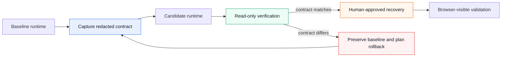

# Architecture: the DSH State Contract

`dsh-ops-skill` treats a DeepSeek Harness runtime as a **replaceable process with a non-replaceable contract**. A healthy HTTP endpoint is not sufficient evidence of recovery: the new process must resolve the same persistent state and launch with the same essential runtime semantics.

## The reliability loop

The loop is intentionally conservative. `dsh-doctor` captures only metadata and filesystem-presence signals; it does not print provider credentials, settings values, session bodies, prompts, storage dumps, Docker inspect output, or any conversation content.

## What forms the contract

| Contract area | Why it matters | Safe verification signal |

|---|---|---|

| State root | DSH resolves persistent data relative to `HOME` and/or `DSH_HOME`. | Root exists; expected artifacts are present. |

| Profiles and settings | Model routes and preset behavior may be loaded from the state root. | Directory and file presence only. |

| Sessions and storage | A blank sidebar may be a path-resolution failure rather than lost data. | File counts only; never read session content. |

| Process launch | Entrypoint, command, workdir, user, ports, and trusted-host policy determine the active runtime. | Compare redacted launch metadata before and after a replacement. |

| Code sandbox | A code-capable agent needs both the shell binary and a working sandbox backend. | Check executable availability; run a no-write smoke test only when explicitly requested. |

| Workspace | A state root and a workspace have different retention and security requirements. | Confirm mount destinations and use an approved temporary write test if needed. |

## Evidence before mutation

The repository is designed around a two-phase operating model.

1. **Evidence phase.** Run the doctor in `verify` or `contract` mode. Collect only redacted, metadata-level evidence.
2. 
2. **Change phase.** Present the diagnosis, a smallest reversible remediation, and a rollback plan. Apply no container, state, credential, or capability change until the operator approves it.
3. 
3. **Validation phase.** Re-run the doctor and confirm browser-visible session metadata, model-route availability, and the needed code-sandbox behavior.
4. 

This distinction matters because a guessed repair can overwrite or shadow the real state root. The correct first response to a blank-instance symptom is to stop, preserve the baseline, and prove the launch contract.

## Security posture

The public Compose overlay makes state and workspace mounts explicit while setting `no-new-privileges` and dropping all Linux capabilities. It intentionally does **not** enable privileged mode, Docker Socket access, `SYS_ADMIN`, external network exposure, or a replacement entrypoint.

> A deployment may require additional capabilities for a specific sandbox backend. Treat that as a separate, explicit threat-model decision—not a default copied from an incident workaround.
> 

For symptom-specific recovery paths, see [Remediation Playbooks](../references/remediation-playbooks.md). For upgrade invariants and redaction rules, see the [State Contract](../references/state-contract.md).

